# cis193_ajax
AJAX demo with icanhazdadjoke API

Adapted from wesbos.com

We will be doing an AJAX example in this exercise using a Dad Joke API.

Every time you click the button, a new random dad joke should be fetched from the API and displayed and the button text will change occasionally.


We will be using the endpoint "get a random dad joke" from the API https://icanhazdadjoke.com/api.

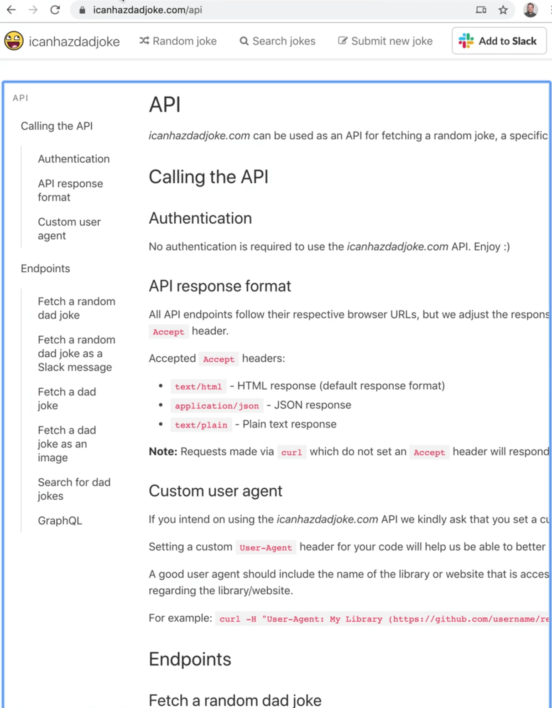

This example will require **custom headers** which is a good thing to learn.

We will also be learning how to ensure that the button text never uses the same text twice, because sometimes random is not random enough.

Open up `index.html`.

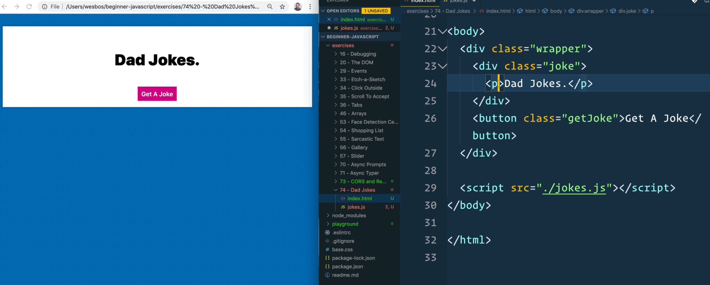

We have some basic HTML to start. We have a div div that contains a paragraph tag in which to display the joke, a button with a class of `getJoke` and a script tag.

Start by selecting the button and paragraph tag inside of the joke div.

```js
const jokeButton = document.querySelector(".getJoke");
const jokeHolder = document.querySelector(".joke");
```

Next create a function that will be responsible for fetching the joke.

Let's look at the API docs for fetching a random joke.

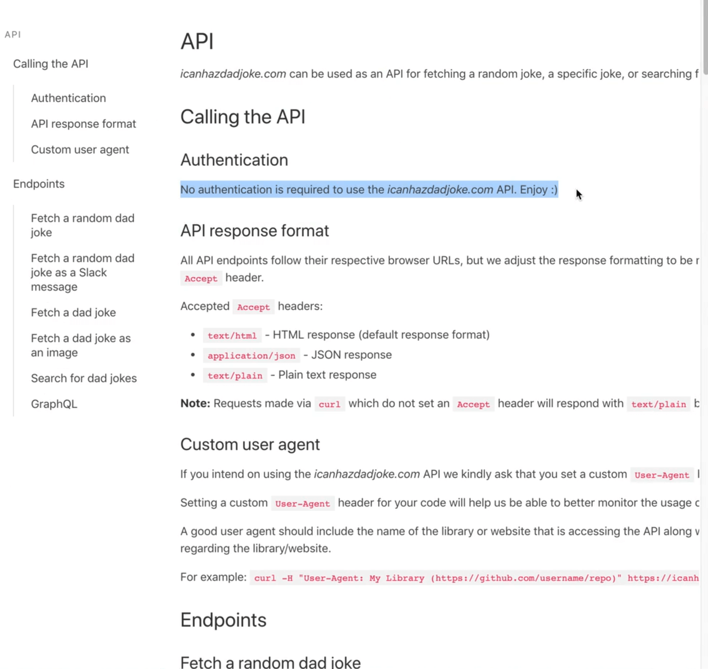

No authentication is required. There is this one note however..

> All API endpoints follow their respective browser URLs, but we adjust the response formatting to be more suited for an API based on the provided HTTP Accept header.

What that means is we can get the joke back as HTML, JSON or plain text. That is interesting because the endpoint is going to be the same for everybody, but depending on what we pass, it will return different values to us.

Let's start by writing the function that will fetch the joke. We will fetch the joke using the endpoint, and then just log the response for now. We will then call `fetchJoke` on runtime. 👇

```js
const jokeButton = document.querySelector(".getJoke");
const jokeHolder = document.querySelector(".joke");

const buttonText = [
  "Ugh.",
  "omg dad.",
  "you are the worst",
  "seriously",
  "stop it.",
  "please stop",
  "that was the worst one",
];

async function fetchJoke() {
  const response = await fetch("https://icanhazdadjoke.com");
  console.log(response);
}

fetchJoke();
```

If you refresh the page, you should see the response is something similar to what you see below.

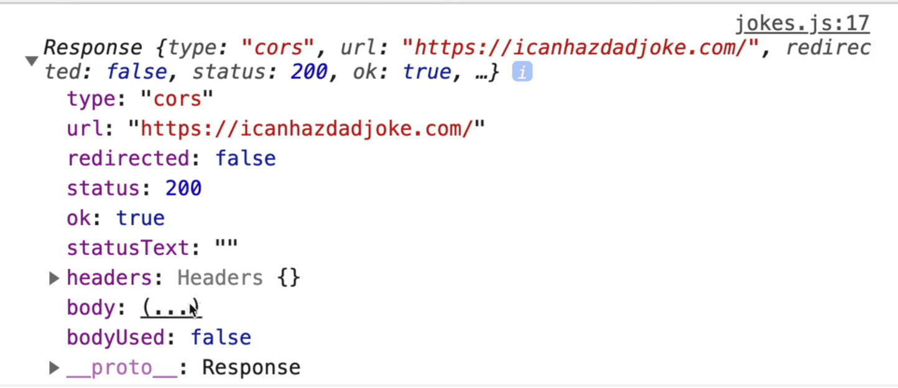

## Headers

Now we need to turn that stream into something that is human readable. Let's try to do `response.json()` like we have used in the past and log that. 👇

```js
const joke = response.json();
console.log(joke);
```

However, if you try that, you will see an error like the following:

> Uncaught (in promise) SyntaxError: Unexpected token < in JSON at position 0

What that errors means is that you have most likely been returned some HTML (since it returned an open angle bracket `<`) and while it is trying to parse that, JSON it is complaining.

The way we can check for that is to go to the network tab and find the actual request and click through it, you will see that the response is just an HTML document that came back.

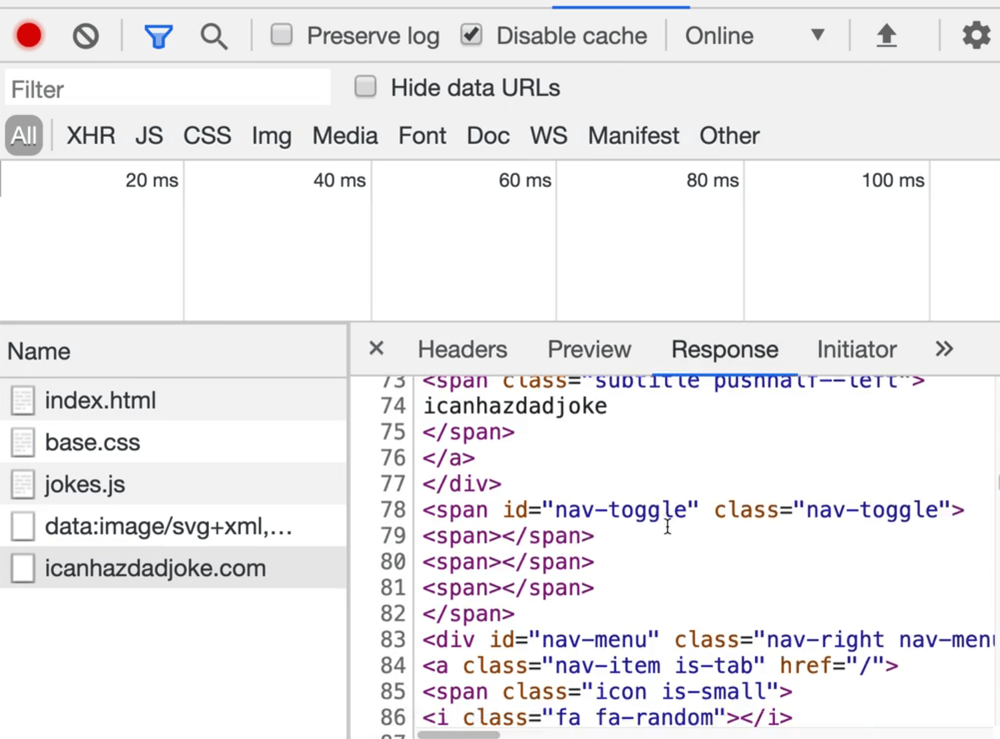

Not all websites allow you to fetch HTML but since this API has a CORS policy setup, we are able to do it.

So the API is telling us we need to pass an **Accept Header** which is either:

- text/html (this is what we just saw)
- application/json
- text/plain

We need to pass that option along a header.

What is a **header**?

A header is some additional information that comes along with a request, kind of like when we pass query parameters, but headers are passed in a different way.

If you look at our dad joke API fetch request in the network tab and click it, you can click the headers tab and see the headers that were passed along with the request, and the ones that were passed along with the response.

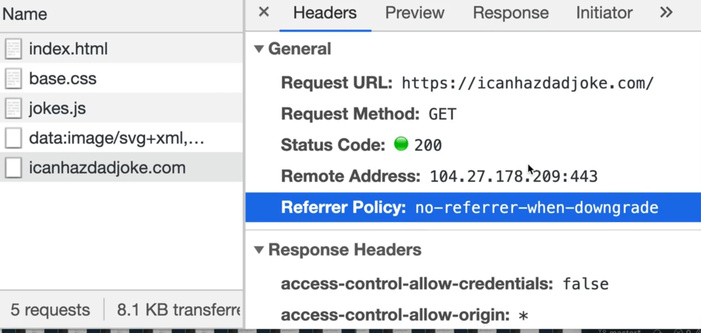

We need to pass along this additional information with `fetch`. The way you do that is you pass a second object to fetch, which can take in a whole bunch of different arguments. 👇

```js
const response = await fetch("http://icanhazdadjoke.com", {
  headers: {},
});

const joke = response.json();
console.log(joke);
```

The documentation said the API requires an **Accept Header** so let's go ahead and add that.

```js
const response = await fetch("http://icanhazdadjoke.com", {
  headers: {
    Accept: "application/json",
  },
});
```

If you refresh the page now, you will see a promise.


That is because we forgot to await the response. Modify the code like so:

```js
const joke = await response.json();
console.log(joke);
```

Now what comes back is the actual data.


```js
const response = await fetch("http://icanhazdadjoke.com", {
  headers: {
    Accept: "application/json",
    Accept: "text/plain",
  },
});
```

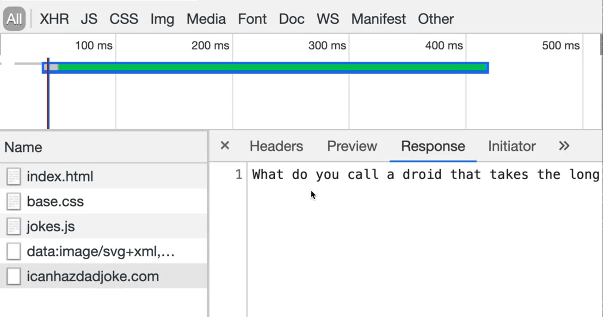

Now if we change that to text/plain (it is fine to have two, the one further down will overwrite the earlier ones, we will see a similar error about unexpected token W). If you look at the response, it says "Unexpected W" because it returned to us text and our application was expecting JSON.

This shows us that we can accept HTML, plain text or JSON, not because we changed the accept headers, but because we are sending a request to a server that offers up those three kinds of response formats.

Change the format back to json and return it from the `fetchJokes` function.

```js
async function fetchJoke() {
  const response = await fetch("http://icanhazdadjoke.com", {
    headers: {
      Accept: "application/json",
    },
  });

  const data = response.json();
  return data;
}
```

Similarly, you could also just return `response.json()` directly.

```js
async function fetchJoke() {
  const response = await fetch("http://icanhazdadjoke.com", {
    headers: {
      Accept: "application/json",
    },
  });

  return response.json();
}
```

That still works because we are in an async function so we will just be awaiting the fetch joke either way.

Wes prefers to do it the way we originally coded it so that if we needed to log the response, it's as easy as adding a log.

Next we want to wire up the button so that when someone clicks it, we will fetch a joke.

Get rid of our call to `fetchJoke` on runtime and instead let's make an async function called `handleClick` which will be responsible for fetching a joke.

```js
async function handleClick() {
  const { joke } = await fetchJoke();
  console.log(joke);
}
```

The reason we are using destructuring is that `fetchJoke` will return an object to us with properties of `id`, `joke` and `status`. We only want the joke property for now so we are destructuring the joke property to it's own variable.

Next add an event listener for the click event, and pass it the `handleClick` function to run on the event.

```js
jokeButton.addEventListener("click", handleClick);
```

Now when you refresh the page and open the console, you will see that every time we click the button, a new joke is logged.

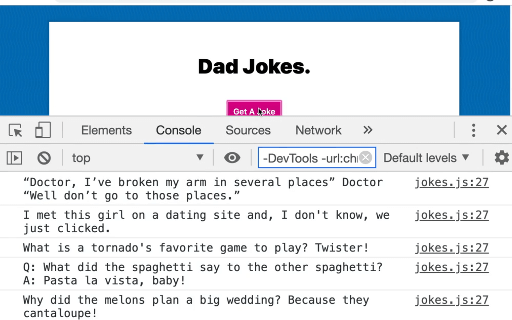

Now within`handleClick`, take the `jokeHolder` and set it's `textContent` to be the joke 👇

```js
async function handleClick() {
  const { joke } = await fetchJoke();
  jokeHolder.textContent = joke;
}
```

When the button is clicked now, the joke should populate and change within the paragraph tag.

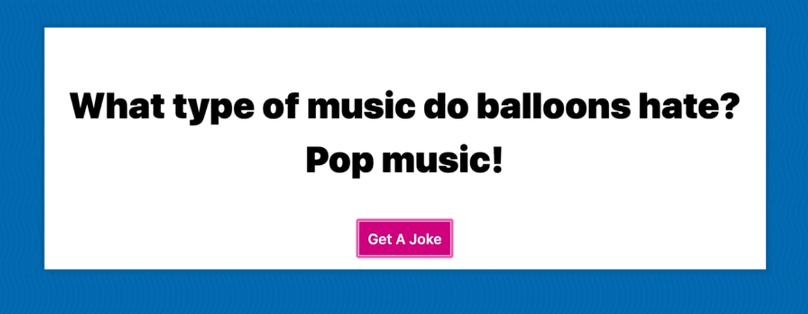

Next we want to take the button text and replace it with one of the strings in the `buttonText` array shown below.👇

```js
const buttonText = [
  "Ugh.",
  "omg dad.",
  "you are the worst",
  "seriously",
  "stop it.",
  "please stop",
  "that was the worst one",
];
```

To do that, call the function `getItemFromArray`, which will accept two arguments:

- the array
- then what to not be (we will implement that second param in a sec).

## Getting a Random Index

If the array is 5 items long, then to find a random index between 0 - 4 we can use `Math.random() * 5`.

```js
function randomItemFromArray(arr, not) {
  const item = arr[Math.floor(Math.random() * arr.length)];
  return item;
}
```

The reason we are using the passed in array to calculate the length and not the `buttonText` variable is that we want this function to be a utility function, and to be able to use them for anything, not just with the `buttonText` array. This allows it to be more generic.

Let's try to run it from the console.

Refresh the HTML page and pass the `buttonText` array to the function we just created.👇

```js
randomItemFromArray(buttonText);
```

Now whenever we run it, we get a random item returned.

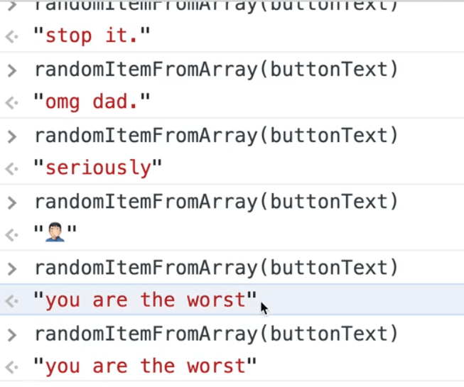

However, sometimes it will randomly return the exact same thing, which makes it seem like nothing happened.

That is why we have that `not` parameter that we are passing. Within the `randomItemFromArray` function, we will use that `not` parameter to ensure the same text isn't selected twice.

To do that, we will add a check for whether the randomly selected item matches the `not` argument, and if it does, we will call the function again. That is an example of **recursion** because the function is calling itself.

```js
if (item == not) {
  console.log("Ah! we used that one last time, look again");
  return randomItemFromArray(arr, not);
}
```

It is possible that this code will run a few times and call itself before it finds one that is not the same.

Let's try running it in the console but this time passing the `not` parameter.

!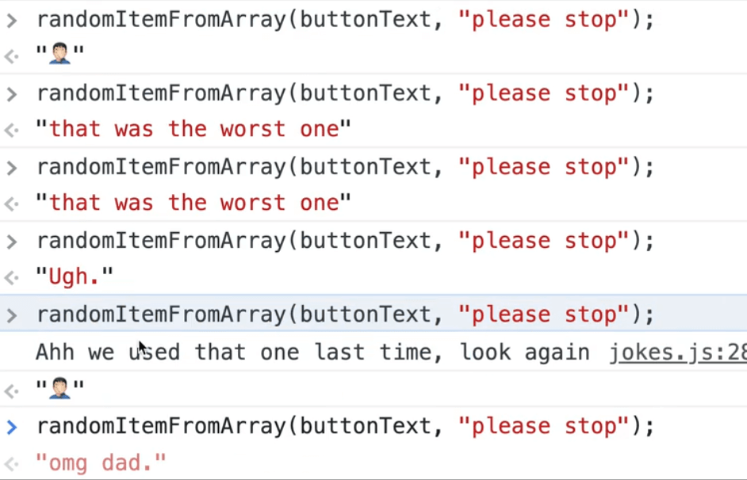

As you can see, when we got "please stop", we logged "Ah we used that one last time look again" to the console and the method called itself again and the next time it returned different text.

So now we can do the following.. 👇

```js
async function handleClick() {
  const { joke } = await fetchJoke();
  jokeHolder.textContent = joke;
  jokeButton.textContent = randomItemFromArray(
    buttonText,
    jokeButton.textContent
  );
}
```

We are ensuring that the button text never stays the same using this line of code `jokeButton.textContent = randomItemFromArray(buttonText, jokeButton.textContent);`. We get the "not" argument from the text that currently exists on the button when it is clicked.

If you refresh the page, you will see it is working very well, and if you just keep clicking it, eventually we will get a log that states "we already used that one".

## Loading State & CSS Loader

This is working, but one thing we are going to do is add a loading state. Feel free to leave this lesson now if you are not interested in loaders.

Let's make a CSS loader.

In the HTML, right before our paragraph tag that will contain our dad jokes, add the following div `<div class="loader"></div>`.

Google "CSS loader" and select `loading.io`.

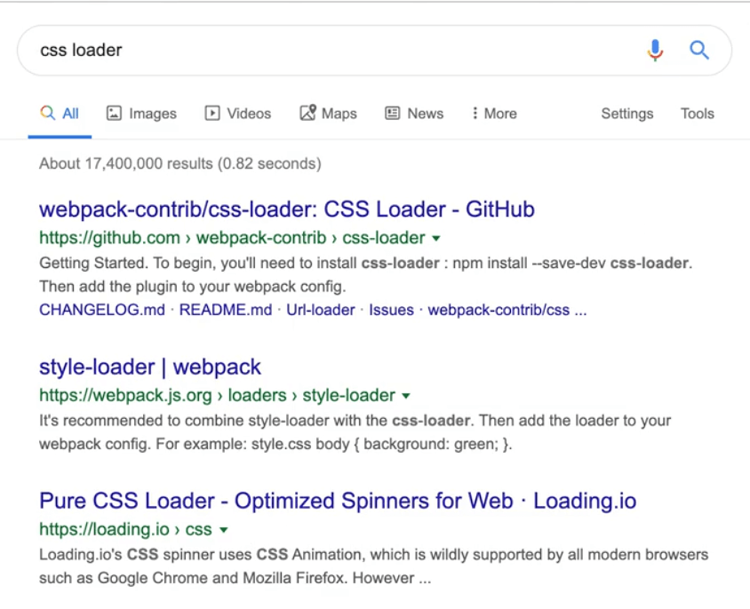

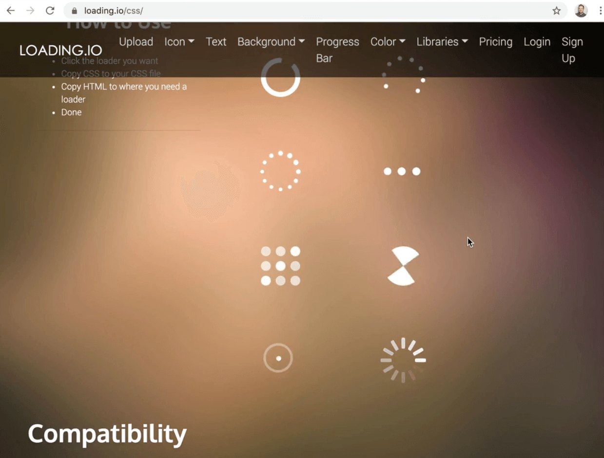

Click on whatever loader you would like to move and it should show you the markup you need to add to the page.

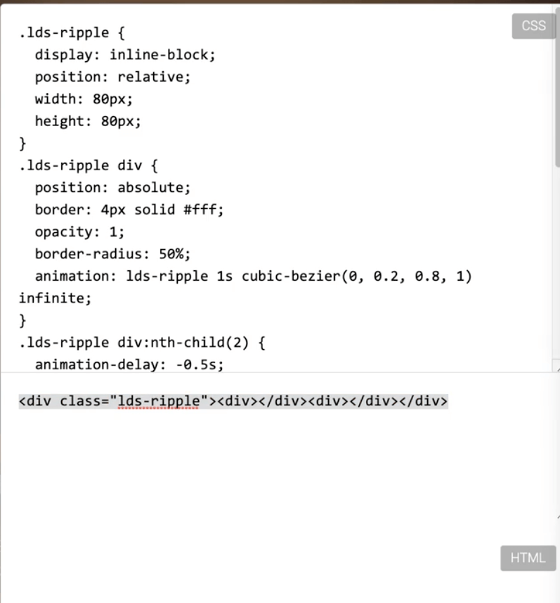

Then let's actually replace the div we just added with the HTML supplied to us for the loader.

```html
<div class="wrapper">
  <div class="joke">
    <div class="lds-ripple">
      <div></div>
      <div></div>
    </div>
    <p>Dad Jokes.</p>
  </div>
  <button class="getJoke">
    <span class="jokeText">Get A Joke</span>
  </button>
</div>
```

Copy the CSS and add it.

```css
.lds-ripple {
  display: inline-block;
  position: relative;

  width: 80px;
  height: 80px;
}

.lds-ripple div {
  position: absolute;
  border: 4px solid white;
  opacity: 1;
  border-radius: 50%;
  animation: lds-ripple 1s cubic-bezier(0, 0.2, 0.8, 1) infinite;
}

.lds-ripple div:nth-child(2) {
  animation-delay: -0.5s;
}

@keyframes lds-ripple {
  0% {
    top: 36px;
    left: 36px;
    width: 0;
    height: 0;
    opacity: 1;
  }

  100% {
    top: 0px;
    left: 0px;
    width: 72px;
    height: 72px;
    opacity: 0;
  }
}
```

If you refresh the page, you will notice we don't see anything.

Let's inspect the element and see what is going on.

If you look at the styles, you will notice the loader is set to the colour white. Let's fix that.👇

```css
.lds-ripple div {
  position: absolute;
  border: 4px solid var(--yellow);
  opacity: 1;
  border-radius: 50%;
  animation: lds-ripple 1s cubic-bezier(0, 0.2, 0.8, 1) infinite;
}
```


Now you can see the loader, it was always working, it was just white so we could not see it.

Add a class of "loader" to the loader on top of the existing `lds-ripple` class.

```html
<div class="lds-ripple loader">
```

At the top of the script, select the loader.

```js
const loader = document.querySelector(".loader");
```

When we fetch within the `fetchJoke` function, let's turn the loader on. By default we will make the loader set to `display:none`.

To do that, create a class of `hidden` and set it to `display:none;` and then add that class to our loader like so: 👇

```html
<div class="lds-ripple loader hidden">
```

Now when we want to turn the loader on, we will call 👇

```js
loader.classList.remove("hidden");
```

When the data comes back, we want to turn it off using 👇

```js
loader.classList.add("hidden");
```

Modify the code like so 👇

```js
async function fetchJoke() {
  loader.classList.remove("hidden");

  const response = await fetch("http://icanhazdadjoke.com", {
    headers: {
      Accept: "application/json",
    },
  });

  const data = response.json();
  loader.classList.add("hidden");
  return data;
}
```

Also hide the button while that is happening.

```js
async function fetchJoke() {
  loader.classList.remove("hidden");
  jokeButton.classList.remove("hidden");

  const response = await fetch("http://icanhazdadjoke.com", {
    headers: {
      Accept: "application/json",
    },
  });

  const data = response.json();
  loader.classList.add("hidden");
  jokeButton.classList.remove("hidden");
  return data;
}
```

However, that looks a bit jarring.

Let's try to put the loader inside of the button instead.

```html
<button class="getJoke">
  <span class="jokeText"
    >Get A Joke
    <div class="lds-ripple loader">
      <div></div>
      <div></div>
    </div>
  </span>
</button>
```


It is showing up because we removed the class of `hidden` from the HTML. Modify the CSS to make the loader white again.

```css
  border: 4px solid var(--yellow);
```


Let's also change the size.

We will make a size variable and set it to `20px` and then modify some of the other CSS to use that variable instead.

```html
<style>
  html {
    --size: 20px;
  }

  .wrapper {
    text-align: center;
  }

  .joke {
    font-size: 5rem;
    font-weight: 900;
  }

  .lds-ripple {
    display: inline-block;
    position: relative;

    width: var(--size);
    height: var(--size);
  }

  .lds-ripple div {
    position: absolute;
    border: 4px solid var(--yellow);
    opacity: 1;
    border-radius: 50%;
    animation: lds-ripple 1s cubic-bezier(0, 0.2, 0.8, 1) infinite;
  }

  .lds-ripple div:nth-child(2) {
    animation-delay: -0.5s;
  }

  @keyframes lds-ripple {
    0% {
      top: calc(var(--size) / 2);
      left: calc(var(--size) / 2);
      width: 0;
      height: 0;
      opacity: 1;
    }

    100% {
      top: 0px;
      left: 0px;
      width: calc(var(--size) * 0.9);
      height: calc(var(--size) * 0.9);
      opacity: 0;
    }
  }

  .hidden {
    display: none;
  }
</style>
```


As you can see above, it is working although it doesn't look great. Our sizing was a bit off.

Let's put the loader back to hidden on page load by adding back that class.

Now we need to modify our buttons to not hide it anymore, so remove that code from `fetchJoke`.

```js
async function fetchJoke() {
  loader.classList.remove("hidden");

  const response = await fetch("http://icanhazdadjoke.com", {
    headers: {
      Accept: "application/json",
    },
  });

  const data = response.json();
  loader.classList.add("hidden");
  return data;
}
```

If you refresh the page and try that now, it will work the first time but not the second time because we overwrite the loader with the text this time.

What we need to do is grab the `span` element within the joke button so we only replace that portion of the button, instead of the entire button.

At the top of the file add `jokeButtonSpan` like so:

```js
const jokeButton = document.querySelector(".getJoke");
const jokeButtonSpan = jokeButton.querySelector(".jokeText");
```

Let's find where in our code we are updating the button text and instead update the `jokeButtonSpan` instead. 👇

```js
async function handleClick() {
  const { joke } = await fetchJoke();
  jokeHolder.textContent = joke;
  jokeButtonSpan.textContent = randomItemFromArray(
    buttonText,
    jokeButtonSpan.textContent
  );
}
```

That works! Let's move onto the next.
